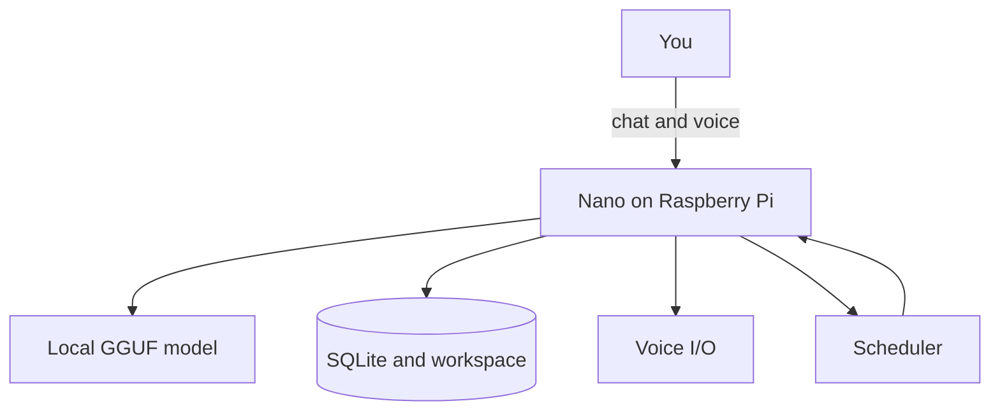

# Nano

**Nano** is a local-first personal assistant that runs on your Raspberry Pi. Your
conversations, timers, and files stay on the device. A self-hosted AI model handles
reasoning — no cloud dependency required.

## How it works

You talk to Nano by chat or voice. Nano orchestrates tools, memory, and scheduling on
the Pi. A local GGUF model powers conversation and planning. SQLite and a workspace
folder keep your data on disk. Voice hardware lets Nano listen and speak. A background
scheduler runs timers and health checks.

## What Nano can do

### Chat and voice

Nano answers questions in plain conversation or coordinates tools when a task needs
action. On Pi hardware, Nano listens for the wake phrase `"hey nano"` and speaks
replies through the speaker. Push-to-talk and remote voice input are supported when
a client is connected. Due timers can be announced out loud.

### Timers

Nano runs countdown timers and stopwatches. Ask to start one, check what is running,
rename an active timer, cancel it, or clear them all.

### Calendar and weather

Nano reads your Google Calendar — list calendars and events for a date range. When
Nano knows your location, it reports current weather conditions from Open-Meteo.

### Memory and files

Nano remembers your chat history and keeps private internal notes for follow-up topics
you asked to discuss later. In the workspace, Nano can read, write, and list files and
run small local Python scripts.

### Stay informed

Nano follows up on deferred topics from internal notes and surfaces proactive offers
when something needs your attention. Boot and idle status keep you oriented. When a
newer version is available, Nano can prompt you to update.

### Startup

Nano boots ready on the Pi and greets you when idle. Optional auto-update pulls the
latest code on service start. Background health checks watch the database, model, and
voice stack.

### System actions

Nano runs health diagnostics in plain language. After confirmation, Nano can wipe
stored conversation and note data. When enabled, Nano can reboot the Raspberry Pi or
restart its own service.

## Technical

**Stack:** FastAPI, SQLite, local GGUF (`llama-cpp-python`), voice (GLaDOS-TTS + Vosk),
APScheduler.

**HTTP API:**

- **Chat** — `POST /api/chat`, `GET /api/chat/wake`
- **Status & stream** — `GET /api/status`, `GET /api/greeting`, `GET /api/events` (SSE)
- **Timers** — `PATCH`/`DELETE` on `/api/timers/{id}` and `/api/stopwatches/{id}`
- **Voice** — `/api/voice/*` (TTS, STT, mode, command)
- **Calendar** — `/api/calendar/*`
- **Weather** — `GET /api/weather/current` (uses last reported location)
- **Proactive** — `GET /api/proactive`, `POST /api/proactive/dismiss`
- **Health** — `GET /api/health` (public)

**Auth:** `Authorization: Bearer <API_KEY>`; SSE also accepts `?api_key=`.

[**nano-ui**](../nano-ui) is a browser interface you can connect to Nano.

For setup and API reference, see
[docs/README.md](docs/README.md).
