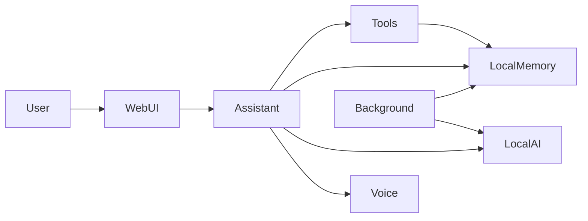

# Nano — Technical Overview

Nano is a local-first personal assistant. It runs on your own computer, keeps
your data on your machine, and is built to work without relying on cloud
services for its core features.

It is written in Python with FastAPI and a vanilla JS web UI, and designed for everyday
use. The project is also being shaped for future deployment on small hardware
such as a Raspberry Pi.

For reasoning, Nano uses a local AI model, currently Qwen2.5 via GGUF.
Spoken replies are optional and handled by a local voice backend when enabled.

## How It Works

At a high level, every interaction follows the same path:

1. You send a message through the web interface, voice, or CLI.
2. Nano interprets what you want and decides whether to answer directly or
   perform an action.
3. Actions run locally — for example saving a note, starting a timer, or
   checking system health.
4. Nano prepares a clear reply and delivers it back to you.

Some requests need a short back-and-forth, such as naming a note or
confirming a destructive wipe. Others are handled in a single step.

## Core Components

| Component | What it does |
|-----------|--------------|
| Web interface | Browser home screen with voice, chat, quick commands, and the nano sheet with Brains, Plans, and Stored Data |
| Assistant | Interprets requests, manages multi-step conversations, and picks the right tool |
| Local memory | SQLite database for notes, reminders, chat history, internal notes, and improvement plans |
| Tools | Registered actions: notes, timers, files, health, GitHub PRs, improvement-plan drafting, and more |
| Voice | Optional spoken replies and wake-phrase listening with `"hey nano"` |
| Background services | Reminder/timer polling, health checks, idle codebase review, and passive improvement-plan drafting |

## Capabilities

### Notes and memory

- Save, list, and look up notes
- Review internal follow-up notes Nano keeps for later discussion
- Wipe all stored data after explicit confirmation

### Reminders and timers

- Set reminders for specific times
- Start, check, and cancel countdown timers

### Files and workspace

- Read, write, and browse files in the local workspace
- Run small Python scripts locally when needed

### System and diagnostics

- Run health checks on Nano itself: database, voice, and AI model
- Report problems in plain language

### GitHub pull requests

When you ask Nano to create a pull request, it runs the full workflow on your
current workspace changes:

- Lint and verification using your configured checks
- AI-assisted branch naming from the diff
- Feature branch creation, commit, push, and `gh pr create`

Available via chat, voice, or the **Create pull request** quick command in the UI.
Requires `git` and the GitHub CLI `gh` to be installed and authenticated.

### Self-improvement plans

Nano can review its own codebase and draft improvement plans for you to read and act on.

- **Background review** — when idle, scans one source file at a time and records
  improvement ideas as internal notes
- **Passive drafting** — when idle long enough and no plan is already waiting,
  drafts a readable plan from the top due self-improvement note
- **One plan at a time** — if an unprocessed plan exists, drafting is skipped until
  you mark it processed in the UI
- **Manual drafting** — you can also ask Nano to draft a plan, for example
  “improve yourself”; the same one-plan gate applies
- **Plans tab** — open the nano sheet → **Plans** to read a plan and mark it
  processed when you are done

Plan content is stored in the `ImprovementPlan` table and exposed via
`/api/improvement-plans`.

### Conversation

- Answer questions and hold a natural conversation when no specific action is required

## Privacy and Data

- Core data is stored locally in SQLite on your machine.
- AI reasoning uses a local model file; no external API is required for that step.
- Voice synthesis is optional and runs locally when enabled.
- GitHub pull requests use `git` and `gh` on your machine when you request them.

## Architecture at a Glance

Nano separates what you see from what happens behind the scenes. The web
interface talks to an assistant layer that coordinates tools, local memory, the
AI model, and optional voice output. Background services handle scheduled
reminders, health monitoring, idle codebase review, and improvement-plan drafting.

