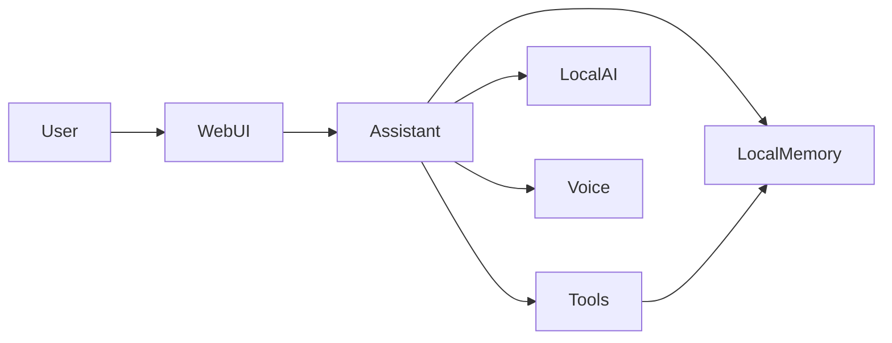

# Nano — Technical Overview

Nano is a local-first personal assistant. It runs on your own computer, keeps
your data on your machine, and is built to work without relying on cloud
services for its core features.

It is written in Python and designed for everyday use. The project is also
being shaped for future deployment on small hardware such as a Raspberry Pi.

For reasoning, Nano uses a local AI model (currently Qwen2.5). Spoken replies
are optional and handled by a local voice system when enabled.

## How It Works

At a high level, every interaction follows the same path:

1. You send a message through the web interface or voice.
2. Nano interprets what you want and decides whether to answer directly or
   perform an action.
3. Actions run locally — for example saving a note, starting a timer, or
   checking system health.
4. Nano prepares a clear reply, reviews it for quality, and delivers it back
   to you.

Some requests need a short back-and-forth (for example naming a note or
confirming a sensitive action). Others are handled in a single step.

## Core Components

| Component | What it does |
|-----------|--------------|
| Web interface | Browser-based home screen with voice, chat, and quick commands |
| Assistant | Interprets requests, manages multi-step conversations, and picks the right action |
| Local memory | On-device database for notes, reminders, timers, and conversation history |
| Tools | Actions Nano can perform on your behalf (health checks, file access, GitHub, and more) |
| Voice (optional) | Text-to-speech for spoken replies |
| Background services | Timer and reminder alerts, periodic health checks, and proactive follow-ups |

## Capabilities

### Notes and memory

- Save, list, and look up notes
- Review internal follow-up notes Nano keeps for later discussion
- Clear all stored data after explicit confirmation

### Reminders and timers

- Set reminders for specific times
- Start, check, and cancel countdown timers

### Files and workspace

- Read, write, and browse files in the local workspace
- Run small Python scripts locally when needed

### System and diagnostics

- Run health checks on Nano itself (database, voice, AI model)
- Report problems in plain language

### Development and self-improvement

- Create GitHub pull requests from current code changes
- Propose and apply improvements to Nano's own codebase, with verification before changes are published
- Review the codebase in the background when idle and surface suggestions proactively

### Conversation

- Answer questions and hold a natural conversation when no specific action is required

## Privacy and Data

- Core data is stored locally in a SQLite database on your machine.
- AI reasoning uses a local model file; no external API is required for that step.
- Voice synthesis is optional and runs locally when enabled.
- GitHub and self-improvement features only run when you explicitly ask for them
  and the required tools are available on your system.

## Architecture at a Glance

Nano separates what you see from what happens behind the scenes. The web
interface talks to an assistant layer that coordinates tools, local memory, the
AI model, and optional voice output. Background services handle scheduled
reminders, health monitoring, and idle-time proactive behavior.

## What Nano Does Not Do

- It does not require internet for core assistant features.
- It does not send your notes or conversations to external services by default.
- It does not modify code on its own without your request and the appropriate
  confirmation flow.
- GitHub and self-improvement features require explicit intent from you.

## For Developers

For setup, configuration, and contribution details, see the project
[README](../README.md) and the source code in the repository.
