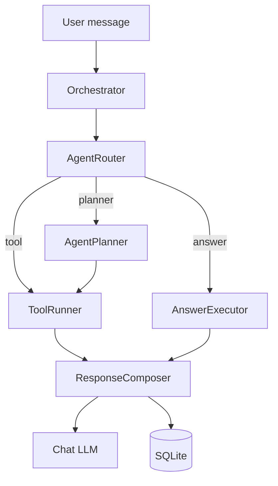
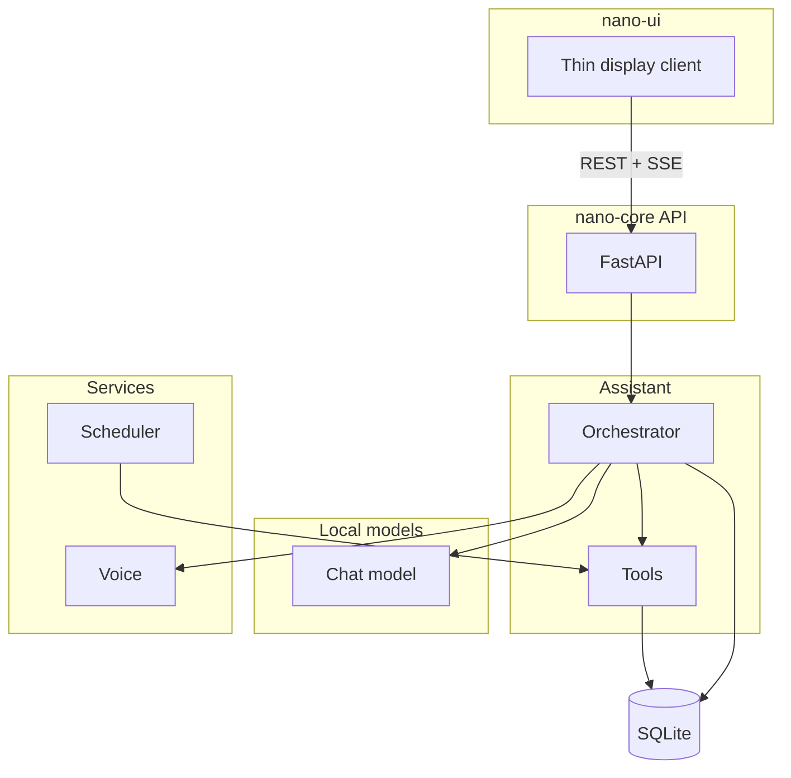

# Nano — Setup & Technical Reference

Product overview and capabilities: [README.md](../README.md).

This document covers the full HTTP
API, architecture, and project layout.

## Stack

| Layer | Technology |
|-------|------------|
| API | FastAPI, Uvicorn |
| Persistence | SQLite via SQLModel |
| Scheduling | APScheduler (background jobs) |
| Local LLM | `llama-cpp-python` (optional `local-llm` extra) |
| Voice | GLaDOS-TTS, Vosk STT (optional `voice` extra) |
| Calendar | Google Calendar API (read-only OAuth) |
| Weather | Open-Meteo forecast API (read-only, no API key) |
| Web UI | Separate **nano-ui** repo — thin client over REST + SSE |

Entry points: `app.main` (API server), `app.cli` (`dev`, `serve`, `start-nano`).

## Local model

Nano uses a single GGUF chat model for conversation, agent coordination, and response polish.
The model loads on first use.

| Role | Default file | Used for |
|------|--------------|----------|
| Chat | `qwen2.5-1.5b-instruct-q5_k_m.gguf` | Conversation, agent planning, response polish |

For config paths, context sizing, and remote providers, see [LLM routing](#llm-routing) below.

## Remote deployment

1. Set `API_KEY` and `CORS_ALLOWED_ORIGINS` on the Pi.
2. Expose the API via Tailscale Funnel, Cloudflare Tunnel, or port forwarding.
3. Deploy **nano-ui** and enter the Pi URL + API key in connection settings.

All processing happens on the Pi. The UI displays state from `GET /api/events` (SSE) and sends commands via REST.

## Request pipeline

Agent mode (`AgentOrchestrator`) is the main path for tool-capable chat:

1. Persist user message → `repository.add_chat_message`
2. Route via `AgentRouter` (rule-based intents before LLM planner)
3. Execute: direct answer, tool call, pending interaction, or `AgentPlanner` JSON loop
4. Compose via `ResponseComposer` → polish/guard pipeline → persist assistant reply

`AssistantService` delegates to `AgentOrchestrator` for both agent and chat modes.
Chat mode (`mode=chat`) skips routing/tools and uses `AnswerExecutor` directly inside the orchestrator.

```mermaid
flowchart TD
    UserMsg[User message] --> Orchestrator
    Orchestrator --> Router[AgentRouter]
    Router -->|tool| ToolRunner
    Router -->|planner| Planner[AgentPlanner]
    Router -->|answer| AnswerExecutor
    Planner --> ToolRunner
    ToolRunner --> Composer[ResponseComposer]
    AnswerExecutor --> Composer
    Composer --> ChatModel[Chat LLM]
    Composer --> Persist[(SQLite)]
```

## LLM routing

`get_llm_client()` in `app/llm/factory.py` implements `LLMClient.complete()`.
Local models are loaded lazily via `load_local_model` in `app/llm/context_sizing.py`
(RAM-aware ladder: 32k → 512). If configured context is too large, Nano probes free
memory, tries smaller sizes, and prefixes the next reply with a downgrade notice.
Use the **System analysis** command (or `analyze_system` tool) to inspect specs and
estimated context limits.

| Role | Config path | Context setting | Call sites |
|------|-------------|-----------------|------------|
| Chat | `llm_model_path` | `llm_context_size` (32k) | Orchestrator, service, planner, answer/response pipeline |

Remote providers (`ollama`, `llama_cpp_server`) use `llm_model` for the model name.
Defaults live in `app/config.py`.

## Project layout

| Path | Responsibility |
|------|----------------|
| `app/api/` | REST routers under `/api/*`, API key auth, tool command metadata |
| `app/common/` | Shared JSON parsing, duration parsing, and domain types (`ProactiveOffer`) |
| `app/integrations/google_calendar/` | Google Calendar auth, client, and formatting |
| `app/integrations/weather/` | Open-Meteo client, WMO formatting, and weather errors |
| `app/runtime/location.py` | In-memory client-reported geographic location |
| `app/workspace/` | Workspace file-walking and inventory hashing |
| `app/assistant/` | Orchestrator, dispatch, router, planner, flows, response pipeline |
| `app/assistant/guard/` | Response quality detectors and LLM rewrite pass |
| `app/tools/` | Registered tool handlers (`*_tools.py` register via `registry.py`) |
| `app/tools/files.py` | Core file I/O used by tools; `file_tools.py` registers the tool wrappers |
| `app/timers/` | Timer parsing, operations, formatting, and API serialization |
| `app/memory/` | SQLModel tables, repositories, and schema migrations |
| `app/proactive/` | Proactive offer state for the web UI |
| `app/llm/` | Client, factory, protocol, and provider backends |
| `app/scheduler/` | Timer and health jobs |
| `app/voice/` | `VoiceOutput` protocol, GLaDOS synthesis, Vosk STT, wake listener |
| `app/system/specs/` | Host memory/CPU probes and system analysis report |

## Database

SQLite file from `database_url` (default `./data/nano_core.sqlite3`). Tables in `app/memory/models.py`:

| Table | Purpose |
|-------|---------|
| `ChatMessage` | Per-conversation history |
| `Timer` | Countdown timers |
| `InternalNote` | Deferred follow-ups |

## HTTP API

| Route | Notes |
|-------|-------|
| `POST /api/chat` | Agent or chat mode |
| `GET /api/chat/wake` | Wake acknowledgement |
| `GET /api/health` | Aggregated health checks (public) |
| `GET /api/status` | Activity state + UI copy constants (includes last reported `location`) |
| `GET /api/system/metrics` | CPU temperature and throttle state |
| `POST /api/location` | Store browser-reported latitude/longitude |
| `GET /api/location` | Last reported location (404 if unset) |
| `GET /api/weather/current` | Current weather for last reported location |
| `GET /api/events` | SSE activity stream |
| `GET /api/tool-commands` | Web UI quick commands |
| `GET /api/storage` | Storage snapshot |
| `GET /api/proactive` | Proactive offer state |
| `GET /api/calendar/calendars` | Available Google calendars |
| `GET /api/calendar/default` | Default configured calendar ID |
| `GET /api/calendar/events` | Events in a date range for one calendar |
| `POST /api/voice` | TTS request |
| `GET /api/voice/mode` | Current Pi wake-word listening mode |
| `PUT /api/voice/mode` | Enable/disable Pi wake-word listening |
| `POST /api/voice/transcribe` | STT for uploaded audio |
| `POST /api/voice/command` | STT + agent command in one call |

Protected routes require `Authorization: Bearer <API_KEY>`. SSE also accepts `?api_key=`.

## Background jobs

Registered in `app/scheduler/jobs.py`:

| Job | Interval setting | Action |
|-----|------------------|--------|
| `check_due_timers` | `timer_poll_interval_seconds` | Fire due timers, announce via voice |
| `check_system_health` | `health_check_interval_seconds` | DB, LLM, voice checks; log/announce failures |

## Architecture

```mermaid
flowchart TB
    subgraph client [nano-ui]
        WebUI[Thin display client]
    end

    subgraph api [nano-core API]
        FastAPI
    end

    subgraph assistant [Assistant]
        Orchestrator
        Tools
    end

    subgraph models [Local models]
        direction LR
        ChatModel[Chat model]
    end

    subgraph services [Services]
        direction LR
        Voice
        Scheduler
    end

    SQLite[(SQLite)]

    WebUI -->|REST + SSE| FastAPI --> Orchestrator
    Orchestrator --> ChatModel
    Orchestrator --> Tools
    Orchestrator --> Voice
    Orchestrator --> SQLite
    Tools --> SQLite
    Scheduler --> Tools
```

Data stays on disk (SQLite, workspace files). LLM inference is local unless
`llm_provider` targets Ollama or an external llama.cpp server.
