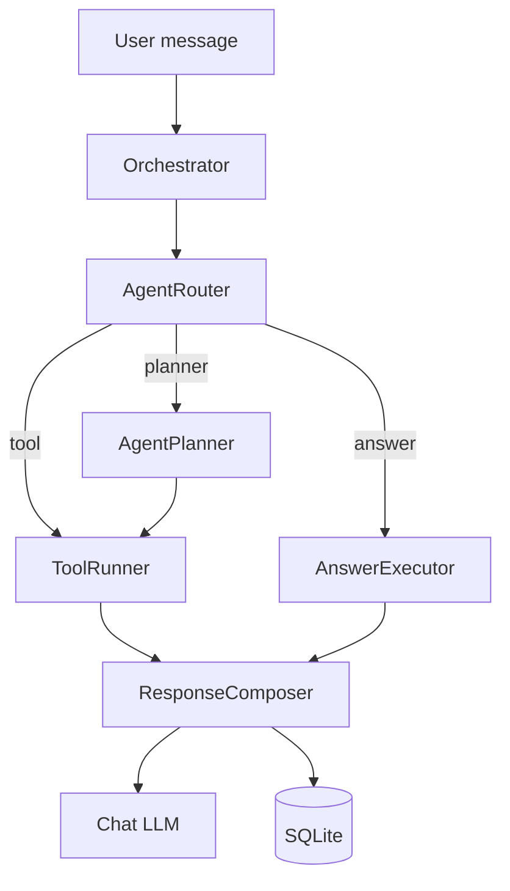
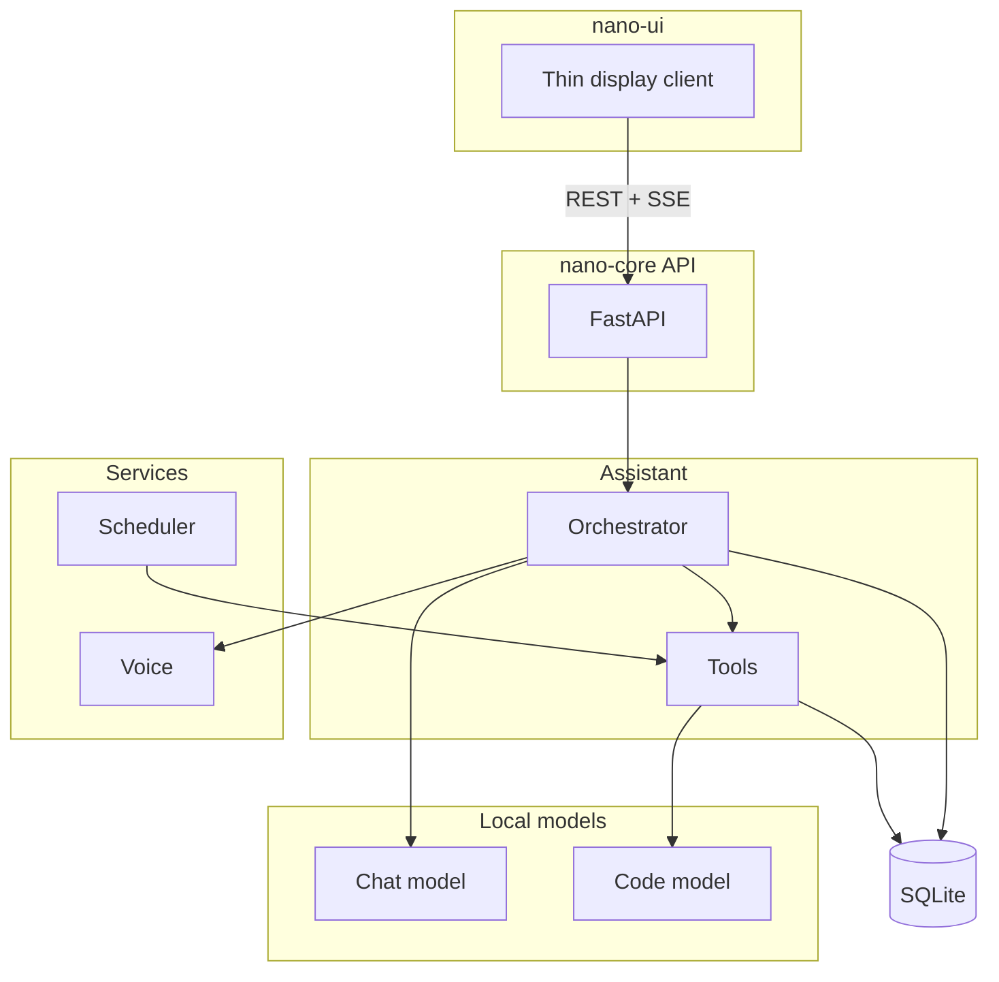

# Nano — Technical Overview

User-facing capabilities and model overview: [README.md](../README.md).

## Stack

| Layer | Technology |
|-------|------------|
| API | FastAPI, Uvicorn |
| Persistence | SQLite via SQLModel |
| Scheduling | APScheduler (background jobs) |
| Local LLM | `llama-cpp-python` (optional `local-llm` extra) |
| Voice | GLaDOS-TTS, Vosk STT (optional `voice` extra) |
| Calendar | Google Calendar API (read-only OAuth) |
| Web UI | Separate **nano-ui** repo — thin client over REST + SSE |

Entry points: `app.main` (API server), `app.cli` (`dev`, `serve`, `start-nano`).

## Remote deployment

1. Set `API_KEY` and `CORS_ALLOWED_ORIGINS` on the Pi.
2. Expose the API via Tailscale Funnel, Cloudflare Tunnel, or port forwarding.
3. Deploy **nano-ui** and enter the Pi URL + API key in connection settings.

All processing happens on the Pi. The UI displays state from `GET /api/events` (SSE) and sends commands via REST.

## Request pipeline

Agent mode (`AgentOrchestrator`) is the main path for tool-capable chat:

1. Persist user message → `repository.add_chat_message`
2. Route via `AgentRouter` (rule-based intents before LLM planner)
3. Execute: direct answer, tool call, pending interaction, or `AgentPlanner` JSON loop
4. Compose via `ResponseComposer` → polish/guard pipeline → persist assistant reply

`AssistantService` delegates to `AgentOrchestrator` for both agent and chat modes.
Chat mode (`mode=chat`) skips routing/tools and uses `AnswerExecutor` directly inside the orchestrator.

```mermaid
flowchart TD
    UserMsg[User message] --> Orchestrator
    Orchestrator --> Router[AgentRouter]
    Router -->|tool| ToolRunner
    Router -->|planner| Planner[AgentPlanner]
    Router -->|answer| AnswerExecutor
    Planner --> ToolRunner
    ToolRunner --> Composer[ResponseComposer]
    AnswerExecutor --> Composer
    Composer --> ChatModel[Chat LLM]
    Composer --> Persist[(SQLite)]
```

## LLM routing

Two `ModelRole` clients (`app/llm/roles.py`), created by `get_llm_client()` and
`get_code_llm_client()` in `app/llm/factory.py`. Both implement `LLMClient.complete()`.
Local models are loaded lazily via `load_local_model` in `app/llm/context_sizing.py`
(RAM-aware ladder: 32k → 512). If configured context is too large, Nano probes free
memory, tries smaller sizes, and prefixes the next reply with a downgrade notice.
Use the **System analysis** command (or `analyze_system` tool) to inspect specs and
estimated context limits.

| Role | Config path | Context setting | Call sites |
|------|-------------|-----------------|------------|
| Chat | `llm_model_path` | `llm_context_size` (32k) | Orchestrator, service, planner, answer/response pipeline |
| Code | `llm_code_model_path` or fallback to chat path | `llm_code_context_size` (32k) | `self_improve_tools`, `background_tick` / `codebase_crawl`, `github_tools` / `pr_naming`, `presence_gate` delivery |

Remote providers (`ollama`, `llama_cpp_server`) use `llm_model` / `llm_code_model` for model names.
Defaults live in `app/config.py`.

## Project layout

| Path | Responsibility |
|------|----------------|
| `app/api/` | REST routers under `/api/*`, API key auth, tool command metadata |
| `app/common/` | Shared JSON parsing and domain types (`ProactiveOffer`) |
| `app/integrations/` | Google Calendar OAuth and event fetching |
| `app/workspace/` | Workspace file-walking utilities |
| `app/assistant/` | Orchestrator, router, planner, flows (timer, wipe, presence), response pipeline |
| `app/tools/` | Registered tool handlers + PR/improvement services |
| `app/memory/` | SQLModel tables, repositories, codebase index |
| `app/proactive/` | Idle crawl, outreach, presence gate, delivery registry |
| `app/llm/` | Client, factory, protocol |
| `app/scheduler/` | Timer, health, proactive, and presence-timeout jobs |
| `app/voice/` | GLaDOS synthesis, Vosk STT, Pi-local wake listener |

## Database

SQLite file from `database_url` (default `./data/nano_core.sqlite3`). Tables in `app/memory/models.py`:

| Table | Purpose |
|-------|---------|
| `ChatMessage` | Per-conversation history |
| `Timer` | Countdown timers |
| `InternalNote` | Deferred follow-ups and self-improvement suggestions |
| `ImprovementPlan` | Drafted text plans |
| `CodebaseFileRecord` | Incremental codebase scan index |

## HTTP API

| Route | Notes |
|-------|-------|
| `POST /api/chat` | Agent or chat mode |
| `GET /api/chat/wake` | Wake acknowledgement |
| `GET /api/health` | Aggregated health checks (public) |
| `GET /api/status` | Activity state + UI copy constants |
| `GET /api/events` | SSE activity stream |
| `GET /api/tool-commands` | Web UI quick commands |
| `GET /api/improvement-plans` | List / detail / process plans |
| `GET /api/storage` | Storage snapshot |
| `GET /api/proactive` | Proactive offer state |
| `GET /api/calendar/calendars` | Available Google calendars |
| `GET /api/calendar/default` | Default configured calendar ID |
| `GET /api/calendar/events` | Events in a date range for one calendar |
| `POST /api/voice` | TTS request |
| `POST /api/voice/transcribe` | STT for uploaded audio |
| `POST /api/voice/command` | STT + agent command in one call |

Protected routes require `Authorization: Bearer <API_KEY>`. SSE also accepts `?api_key=`.

## Background jobs

Registered in `app/scheduler/jobs.py`:

| Job | Interval setting | Action |
|-----|------------------|--------|
| `check_due_timers` | `timer_poll_interval_seconds` | Fire due timers, announce via voice |
| `check_system_health` | `health_check_interval_seconds` | DB, LLM, voice checks; log/announce failures |
| `run_proactive_background_tick` | `proactive_background_interval_seconds` | Code-model file crawl; silent background plan draft when idle |
| `check_presence_timeouts` | `presence_check_poll_interval_seconds` | Defer unanswered presence checks |

## Configuration

Settings live in `app/config.py`. Override any value in `.env` if needed — most
defaults work out of the box, including model paths under `models/`.

Remote API: `API_KEY`, `CORS_ALLOWED_ORIGINS`, `API_BIND_HOST`, `API_BIND_PORT`.

Voice: `VOICE_INPUT_ENABLED`, `VOICE_INPUT_DEVICE`, `VOICE_OUTPUT_DEVICE`, `STT_MODEL_PATH`,
`VOICE_WAKE_PHRASE`, `VOICE_PLAYBACK_MODE` (`local`, `browser`, or `both`).

Google Calendar settings: `GOOGLE_CREDENTIALS_PATH`, `GOOGLE_TOKEN_PATH`,
`GOOGLE_CALENDAR_TIMEZONE`, `GOOGLE_CALENDAR_IDS`. CLI: `auth-google-calendar`,
`google-calendars`.

Install extras from `pyproject.toml` as needed: `local-llm` for GGUF models,
`voice` for Vosk STT, `dev` for tests and linting.

## Architecture

```mermaid
flowchart TB
    subgraph client [nano-ui]
        WebUI[Thin display client]
    end

    subgraph api [nano-core API]
        FastAPI
    end

    subgraph assistant [Assistant]
        Orchestrator
        Tools
    end

    subgraph models [Local models]
        direction LR
        ChatModel[Chat model]
        CodeModel[Code model]
    end

    subgraph services [Services]
        direction LR
        Voice
        Scheduler
    end

    SQLite[(SQLite)]

    WebUI -->|REST + SSE| FastAPI --> Orchestrator
    Orchestrator --> ChatModel
    Orchestrator --> Tools
    Orchestrator --> Voice
    Tools --> CodeModel
    Orchestrator --> SQLite
    Tools --> SQLite
    Scheduler --> Tools
```

Data stays on disk (SQLite, workspace files). LLM inference is local unless
`llm_provider` targets Ollama or an external llama.cpp server. GitHub PR flow
shells out to `git` and `gh` on the host.
