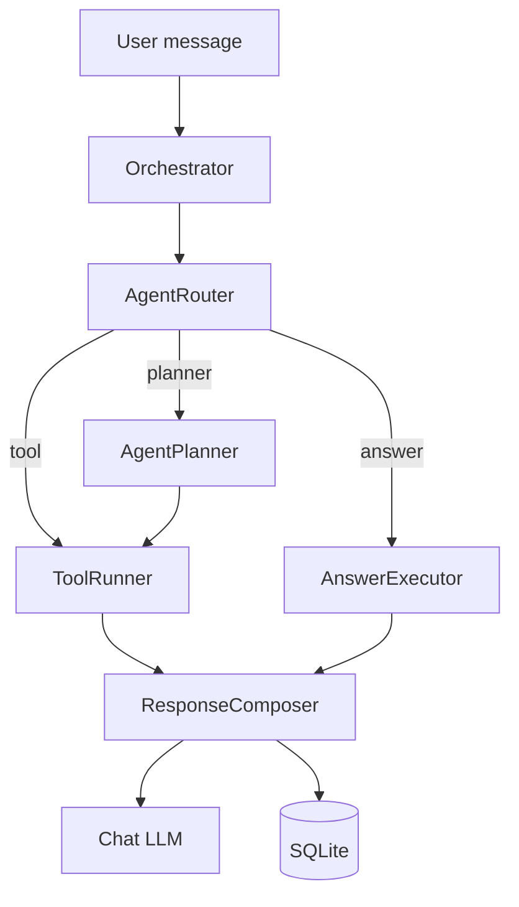
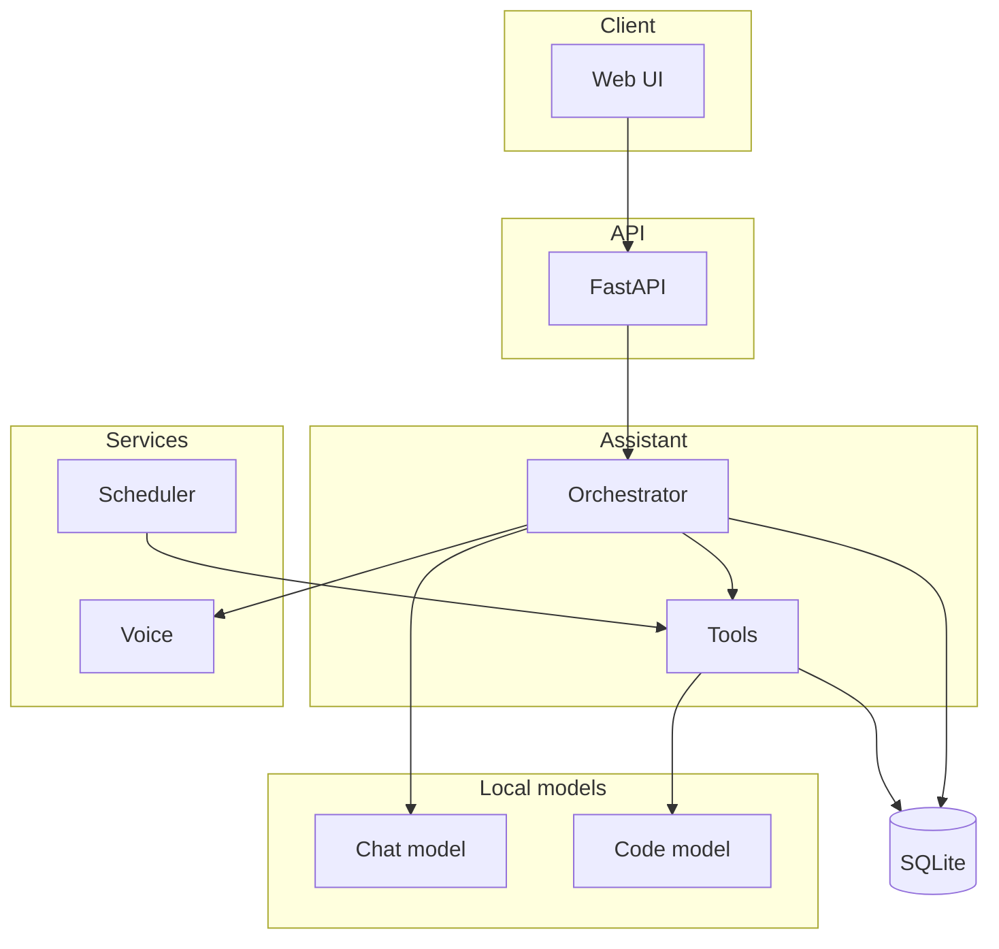

# Nano — Technical Overview

User-facing capabilities and model overview: [README.md](../README.md).

## Stack

| Layer | Technology |
|-------|------------|
| API | FastAPI, Uvicorn |
| Persistence | SQLite via SQLModel |
| Scheduling | APScheduler (background jobs) |
| Local LLM | `llama-cpp-python` (optional `local-llm` extra) |
| Voice | GLaDOS-TTS (`./vendor/GLaDOS-TTS`) |
| Web UI | Vanilla JS, SSE (`/events`) |

Entry points: `app.main` (web server), `app.cli` (CLI / `start-nano`).

## Request pipeline

Agent mode (`AgentOrchestrator`) is the main path for tool-capable chat:

1. Persist user message → `repository.add_chat_message`
2. Route via `AgentRouter` (rule-based intents before LLM planner)
3. Execute: direct answer, tool call, pending interaction, or `AgentPlanner` JSON loop
4. Compose via `ResponseComposer` → polish/guard pipeline → persist assistant reply

Chat-only mode (`AssistantService`) skips routing/tools and uses `AnswerExecutor` directly.

```mermaid
flowchart TD
    UserMsg[User message] --> Orchestrator
    Orchestrator --> Router[AgentRouter]
    Router -->|tool| ToolRunner
    Router -->|planner| Planner[AgentPlanner]
    Router -->|answer| AnswerExecutor
    Planner --> ToolRunner
    ToolRunner --> Composer[ResponseComposer]
    AnswerExecutor --> Composer
    Composer --> ChatModel[Chat LLM]
    Composer --> Persist[(SQLite)]
```

## LLM routing

Two `ModelRole` clients (`app/llm/roles.py`), created by `get_llm_client()` and
`get_code_llm_client()` in `app/llm/factory.py`. Both implement `LLMClient.complete()`.
Local models are loaded lazily via `_load_local_model` (LRU cache keyed by path + context).

| Role | Config path | Context setting | Call sites |
|------|-------------|-----------------|------------|
| Chat | `llm_model_path` | `llm_context_size` (32k) | Orchestrator, service, planner, answer/response pipeline |
| Code | `llm_code_model_path` or fallback to chat path | `llm_code_context_size` (8k) | `self_improve_tools`, `background_tick` / `codebase_crawl`, `github_tools` / `pr_naming`, `presence_gate` delivery |

Remote providers (`ollama`, `llama_cpp_server`) use `llm_model` / `llm_code_model` for model names.
Defaults live in `app/config.py`.

## Project layout

| Path | Responsibility |
|------|----------------|
| `app/api/` | REST routers: chat, health, memory, improvement plans, proactive, runtime, voice |
| `app/assistant/` | Orchestrator, router, planner, flows (timer, wipe, presence), response pipeline |
| `app/tools/` | Registered tool handlers + PR/improvement services |
| `app/memory/` | SQLModel tables, repositories, codebase index |
| `app/proactive/` | Idle crawl, outreach, presence gate, delivery registry |
| `app/llm/` | Client, factory, protocol |
| `app/scheduler/` | Timer, health, proactive, and presence-timeout jobs |
| `app/voice/` | GLaDOS synthesis and volume |
| `app/web/` | Home page, static assets |

## Database

SQLite file from `database_url` (default `./data/nano_core.sqlite3`). Tables in `app/memory/models.py`:

| Table | Purpose |
|-------|---------|
| `ChatMessage` | Per-conversation history |
| `Timer` | Countdown timers |
| `InternalNote` | Deferred follow-ups and self-improvement suggestions |
| `ImprovementPlan` | Drafted text plans |
| `CodebaseFileRecord` | Incremental codebase scan index |

## HTTP API

| Route | Notes |
|-------|-------|
| `POST /chat` | Agent or chat mode |
| `GET /chat/wake` | Wake acknowledgement |
| `GET /health` | Aggregated health checks |
| `GET /api/status`, `GET /events` | Activity state + SSE stream |
| `GET /api/improvement-plans` | List / detail / process plans |
| `GET /api/storage` | Storage snapshot |
| `GET /api/proactive` | Proactive offer state |
| `POST /api/voice` | TTS request |

## Background jobs

Registered in `app/scheduler/jobs.py`:

| Job | Interval setting | Action |
|-----|------------------|--------|
| `check_due_timers` | `timer_poll_interval_seconds` | Fire due timers, announce via voice |
| `check_system_health` | `health_check_interval_seconds` | DB, LLM, voice checks; log/announce failures |
| `run_proactive_background_tick` | `proactive_background_interval_seconds` | Code-model file crawl; silent background plan draft when idle |
| `check_presence_timeouts` | `presence_check_poll_interval_seconds` | Defer unanswered presence checks |

## Configuration

Settings live in `app/config.py`. Override any value in `.env` if needed — most
defaults work out of the box, including model paths under `models/`.

Install extras from `pyproject.toml` as needed: `local-llm` for GGUF models,
`voice` for speech, `dev` for tests and linting.

## Architecture

```mermaid
flowchart TB
    subgraph client [Client]
        WebUI[Web UI]
    end

    subgraph api [API]
        FastAPI
    end

    subgraph assistant [Assistant]
        Orchestrator
        Tools
    end

    subgraph models [Local models]
        direction LR
        ChatModel[Chat model]
        CodeModel[Code model]
    end

    subgraph services [Services]
        direction LR
        Voice
        Scheduler
    end

    SQLite[(SQLite)]

    WebUI --> FastAPI --> Orchestrator
    Orchestrator --> ChatModel
    Orchestrator --> Tools
    Orchestrator --> Voice
    Tools --> CodeModel
    Orchestrator --> SQLite
    Tools --> SQLite
    Scheduler --> Tools
```

Data stays on disk (SQLite, workspace files). LLM inference is local unless
`llm_provider` targets Ollama or an external llama.cpp server. GitHub PR flow
shells out to `git` and `gh` on the host.
